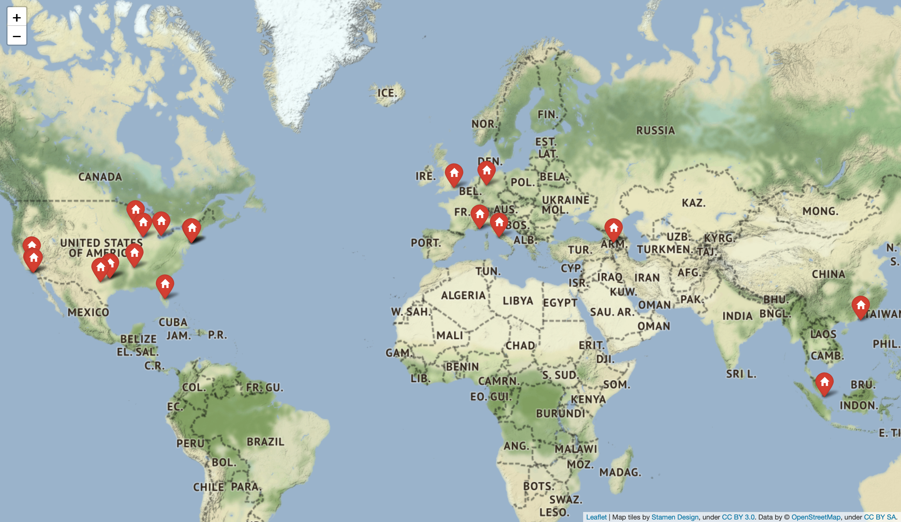

**Web map with twitter friends' locations**

Using this web app you can get locations of one's twitter friends. You have to enter the username and soon you will receive generated map that will show you all the appropriate locations. Each marker represents somebody's location and you can see a list of friends that live there by clicking on it. 

**Prerequisites**

You have to install modules folium, flask and geopy. Module json also should be used.

**Conclusion**

This map is useful if you need to find somebody's locations.

**The result of launching**

main page:

generated map with friends' locations:

list of friends that live in marked city:
